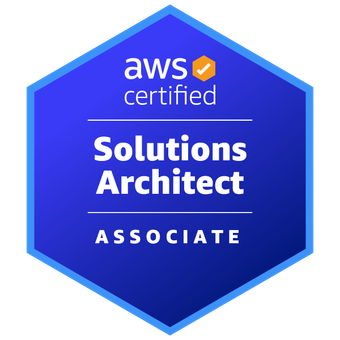
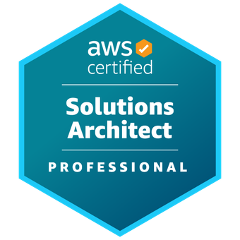
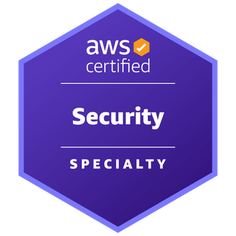

# Contact info
{width=15} ugolnikovroman@gmail.com · {width=15} [LinkedIn](https://www.linkedin.com/in/roman-uholnikov/) · 

---

## Professional Summary
Engineering Manager / Engineering Leader with 12+ years of experience across backend engineering, cloud infrastructure, team leadership, and high‑scale system delivery. Experienced in Java ecosystems, Spring frameworks, distributed systems, AWS, DevOps tooling, and leading engineering teams at global technology companies.  

---
## Certifications 
{width=70} {width=70} {width=70}

- **AWS Certified Solutions Architect – Professional** — [AWS, issued 2020–2023](https://www.credly.com/badges/1cf4aca5-815b-4d2d-a2e6-63264191a87e/public_url) 
- **AWS Certified Security – Specialty** — [AWS, issued 2019–2022](https://www.credly.com/badges/21dfb7c5-9556-4678-ae65-2b619e1a7d39/public_url)
- **AWS Certified Solutions Architect – Associate** — [AWS, issued 2019–2022](https://www.credly.com/badges/0bbfe174-1ea6-4120-98e7-1a84d197c8de/public_url)
- **IELTS Academic** — British Council, 2017–2019 · Cert ID: 17UA001017UHOR020A   
- **Hippo Certified Developer** — Hippo CMS 

---

## Work Experience

### **Senior Engineering Manager — Affinidi**  
**Location:** Singapore/Germany/Remote  
**Dates:** 03.2024 – Present (2 years)   
**Technologies Used:** SSI, cryptography, Identity, OID4vp , Ory (OAuth2 server), AWS (primarily serviceless, CDK), Prometheus, K8N, ELK, HashiCorp Vault, Docker, NodeJs, Go, Dart, Rust, Flutter, Postgress , Terraform
**What Was Done:**
- Established and later restructured and unified on-call practice across the development department, bringing a consistent and well-organized on-call schedule and breaking knowledge silos across engineering teams. That reduced the number of external user incidents and reduced the reaction time on the incident
-  Restructured and reorganized way of working across the development department, brought structure and clarity while keeping the engineering department flexible and adaptive to business requests. 
- Took leadership of the overall Engineering team, meanwhile managed stable and predictable delivery across the department via defining and aligning SSDLC across the engineering department 
- Build a diverse (20+ nationalities), High-Performing Team Culture by talent development, hiring, and performance management. Acted as a hiring manager for dozens of roles (from Interns to Engineering Managers).  
- Contribute to architecture and code for scalable backend services and platform components. Enabled teams to be a self-sufficient engineering team that doesn't rely on external knowledge (platform). 
- Organized company-wide workshops/hackathons/Demos required to keep the organization aligned, informed, and engaged
- Driven high‑risk, business‑critical project delivery (different domains, mobile/backend/frontend) and mentored other managers to elevate execution standards.

### **Engineering Leader — Affinidi**  
**Location:** Singapore/Germany/Remote  
**Dates:** 11.2021 – 03.2024 (2.5 years)   
**What Was Done:**
- Contribute to architecture and code for scalable backend services and platform components. Enabled teams to be a self-sufficient engineering team that doesn't rely on external knowledge (platform). 
- Organized team-wide workshops/Demos required to keep the team aligned, informed, and engaged
- Drove high‑risk, business‑critical project delivery in a stable and predictable way
- Bridged my team with other departments and integration partners to drive alignment, clarity, and smooth cross‑functional execution
- Led up to 16 direct reports, overseeing performance, mentorship, and career progression to build a strong and resilient engineering team. 
- Established the team’s first-ever on‑call practice and equipped engineers with the tools, processes, and mindset needed to confidently support critical production infrastructure 24/7.

---

### **Technical Lead — Nordstrom**  
**Dates:** 06.2021 - 11.2021 (6 months) 
**Technologies Used:** Java, Spring Framework, HashiCorp, K8N, Jenkins, Gradle, Terraform, AWS (DMS, Dynamo, S3, IAM, KMS, Lambda), MySQL,  
**What Was Done:**
- Provided technical leadership contributing to system architecture and backend engineering.  
- Collaborated with product and engineering teams on platform/product enhancements.

---

### **Manager, Engineering — Conductor, Inc.**  
**Dates:** 04.2018 – 06.2021 (3.3 years)  
**Technologies Used:** Java, Spring (Core, MVC, Data, Cloud, Security), AWS, Docker/Kubernetes, Jenkins, GoCD, Selenium, Snowflake, Mockito, SQL/Transact SQL,  Contract tests (Spring, Pact), K8N, Istio, Helm, 
**What Was Done:**
- Led a team of 5 developers designing and implementing high‑scale software solutions. 
- Previously served as **Java Tech Lead**, contributing to architectural decisions and hands‑on development.  
- Delivered backend services and enterprise features using Java/Spring and CI/CD tooling.  
- Lead team though Agile/Scrum processes, ensuring quality and delivery reliability.

---

### **Senior Java Developer, Tech lead — Infopulse**  
**Dates:** 09.2016 – 03.2018 (1.8 years)   
**Technologies Used:** Java, Spring (Boot, Cloud, Config, MVC), MySQL, MSSQL, Selenium, Hibernate, Tomcat, Jenkins, Docker, Liquibase , JMS
**What Was Done:**
- Delivered enterprise-grade Java backend solutions across multiple customer projects.  
- Developed REST services, data integrations, and CMS-driven features.  
- Improved automation and CI/CD pipelines with Jenkins, Docker, Liquibase. 

---

### **Java Developer — Levi9**  
**Dates:** 02.2014 – 08.2016 (2.6 years)   
**Technologies Used:** Hippo CMS, Java EE 6/8, JCR(Jackrabbit), Groovy, JSP, Tomcat 7, Maven 3, JUnit 4, Mockito, Java EE 8, Spring (Core, MVC, Security, Boot, Security), Hibernate, JSP, Gradle, REST Assured, RAML, Docker, Sonarqube, GoCD (CI), Liquibase 
**What Was Done:**
- developing new functionality and modules, fixing bugs
- writing unit and automation tests
- daily communication with client
- working in distributed team
- facilitating scrum events (demo’s, retrospectives, stand-ups) 

___

### **Sofware Developer — Energotrans**  
**Dates:** 02.2013 – 01.2014 (1 years)   
**Technologies Used:** MSSQL, JSP, Struts, Spring IoC, Spring Data, JSF, Primefaces, Hibernate, NetBeans, PHP
**What Was Done:**
- Migrating legacy software from Windows Desktop(.NET Framework + MSSQL) to Java Web Application 
- Designing (Transact SQL) storage procedures

---
## Education
s
